# Linux Crash Course - Introduction

## Table of Contents
- [History of Linux](#history-of-linux)
- [What is an Operating System?](#what-is-an-operating-system)
- [The Linux Kernel](#the-linux-kernel)
- [Linux Distributions](#linux-distributions)
- [Red Hat Enterprise Linux (RHEL)](#red-hat-enterprise-linux-rhel)
- [Open Source Philosophy](#open-source-philosophy)

---

## History of Linux

### The Beginning (1991)
- **Linus Torvalds**, a Finnish computer science student at the University of Helsinki, created Linux in 1991
- Started as a personal project - a free operating system kernel
- First announced on August 25, 1991, in a Usenet posting
- Originally called "Freax" but was renamed to "Linux" (Linus + Unix)

### Unix Roots
- Linux was inspired by **MINIX**, a Unix-like teaching OS created by Andrew Tanenbaum
- Unix was developed in the 1970s at AT&T Bell Labs by Ken Thompson and Dennis Ritchie
- Linux is "Unix-like" but was written from scratch (not Unix code)

### The GNU Connection
- **Richard Stallman** started the GNU Project in 1983
- GNU = "GNU's Not Unix" (recursive acronym)
- GNU provided essential tools (compilers, editors, shell) that Linux needed
- Technically called **GNU/Linux** - Linux kernel + GNU tools

### Timeline
| Year | Event |
|------|-------|
| 1969 | Unix development begins at Bell Labs |
| 1983 | GNU Project launched by Richard Stallman |
| 1991 | Linus Torvalds releases Linux kernel v0.01 |
| 1992 | Linux released under GPL license |
| 1993 | Debian and Slackware distributions emerge |
| 1994 | Red Hat Linux 1.0 released |
| 2003 | Red Hat Enterprise Linux (RHEL) launched |
| 2004 | Ubuntu first release |
| Present | Linux powers servers, cloud, Android, IoT, supercomputers |

---

## What is an Operating System?

An **Operating System (OS)** is system software that manages computer hardware and software resources and provides common services for programs.

### Core Functions

```mermaid
flowchart TB
    subgraph os["Operating System Layers"]
        direction TB
        A["📱 Applications"]
        B["💻 Shell / CLI / GUI"]
        C["📚 System Libraries"]
        D["🐧 KERNEL"]
        E["🖥️ Hardware"]
    end
    
    A --> B
    B --> C
    C --> D
    D --> E
    
    style A fill:#e1f5fe,color:#000
    style B fill:#b3e5fc,color:#000
    style C fill:#81d4fa,color:#000
    style D fill:#4fc3f7,color:#000,stroke:#01579b,stroke-width:3px
    style E fill:#29b6f6,color:#000
```


### Key Responsibilities
1. **Process Management** - Creating, scheduling, and terminating processes
2. **Memory Management** - Allocating and deallocating memory space
3. **File System Management** - Organizing and managing files on storage devices
4. **Device Management** - Managing device communication via drivers
5. **Security & Access Control** - User authentication and permissions
6. **Networking** - Managing network connections and protocols

---

## The Linux Kernel

### What is the Kernel?
The **kernel** is the core component of the Linux operating system. It acts as a bridge between applications and the actual hardware of the computer.

### Kernel Responsibilities

| Function | Description |
|----------|-------------|
| **Process Scheduling** | Decides which process runs when (multitasking) |
| **Memory Management** | Manages RAM, virtual memory, and swap space |
| **Device Drivers** | Interfaces with hardware devices |
| **System Calls** | Provides API for programs to request kernel services |
| **File Systems** | Manages how data is stored and retrieved |
| **Networking Stack** | Handles network protocols (TCP/IP, etc.) |

### Kernel Types
- **Monolithic Kernel** - Linux uses this type
  - All OS services run in kernel space
  - Fast performance due to less context switching
  - Uses loadable kernel modules for flexibility

### Kernel Space vs User Space


### Checking Kernel Information (RHEL)
```bash
# Display kernel version
uname -r

# Display all system information
uname -a

# Detailed kernel version
cat /proc/version

# View kernel messages
dmesg | head -50

# List loaded kernel modules
lsmod
```

---

## Linux Distributions

A **Linux distribution (distro)** is an operating system made from the Linux kernel plus a collection of software packages.

### Major Distribution Families


### Package Managers by Family
| Family | Package Format | Package Manager |
|--------|----------------|-----------------|
| Red Hat (RHEL/CentOS/Fedora) | `.rpm` | `dnf` / `yum` |
| Debian (Ubuntu/Mint) | `.deb` | `apt` / `dpkg` |
| SUSE | `.rpm` | `zypper` |
| Arch | `.pkg.tar.zst` | `pacman` |

---

## Red Hat Enterprise Linux (RHEL)

### Overview
- **Enterprise-grade** Linux distribution by Red Hat (owned by IBM since 2019)
- Focus on **stability, security, and support**
- Subscription-based with commercial support
- Industry standard for enterprise servers and cloud

### RHEL Ecosystem


### RHEL Versions
| Version | Release Year | Kernel Version | Support Until |
|---------|--------------|----------------|---------------|
| RHEL 7  | 2014         | 3.10           | 2024 (ELS 2028) |
| RHEL 8  | 2019         | 4.18           | 2029 (ELS 2032) |
| RHEL 9  | 2022         | 5.14           | 2032 (ELS 2035) |

### Key RHEL Features
- **SELinux** - Security-Enhanced Linux (mandatory access control)
- **systemd** - System and service manager
- **firewalld** - Dynamic firewall management
- **Cockpit** - Web-based administration interface
- **Podman** - Container management (Docker alternative)
- **dnf** - Package manager (replaced yum in RHEL 8)

### RHEL File System Hierarchy


---

## Open Source Philosophy

### The Four Freedoms (Free Software Foundation)
1. **Freedom 0**: Run the program for any purpose
2. **Freedom 1**: Study and modify the source code
3. **Freedom 2**: Redistribute copies
4. **Freedom 3**: Distribute modified versions

### Common Licenses
| License | Description |
|---------|-------------|
| **GPL v2/v3** | Linux kernel license; modifications must also be open source |
| **MIT** | Permissive; can be used in proprietary software |
| **Apache 2.0** | Permissive with patent protection |
| **BSD** | Very permissive; minimal restrictions |

### Why Linux?
- ✅ **Free and Open Source** - No licensing costs
- ✅ **Secure** - Fewer viruses, strong permissions model
- ✅ **Stable** - Powers 96%+ of world's top web servers
- ✅ **Flexible** - Runs on everything from IoT to supercomputers
- ✅ **Community** - Massive developer and user community
- ✅ **Enterprise Support** - Commercial options (RHEL, SUSE, Ubuntu Pro)

---

## Quick Reference: Basic System Info Commands

```bash
# System Information
uname -a                    # All system info
hostnamectl                 # Hostname and OS info
cat /etc/redhat-release     # RHEL version
cat /etc/os-release         # OS details

# Hardware Information
lscpu                       # CPU information
free -h                     # Memory usage
lsblk                       # Block devices (disks)
df -h                       # Disk space usage

# Kernel Information
uname -r                    # Kernel release
lsmod                       # Loaded kernel modules
modinfo <module>            # Module information
```

---

**[← Back to Index](README.md)**  
**Next: [File Manipulation Commands](02_file_manipulation.md)**
