# Linux Crash Course - Boot Process & Troubleshooting

## Table of Contents
- [Linux Boot Process Overview](#linux-boot-process-overview)
- [BIOS vs UEFI](#bios-vs-uefi)
- [GRUB2 Bootloader](#grub2-bootloader)
- [systemd Boot Process](#systemd-boot-process)
- [Boot Targets (Runlevels)](#boot-targets-runlevels)
- [Kernel Parameters](#kernel-parameters)
- [Recovery and Rescue Mode](#recovery-and-rescue-mode)
- [Root Password Reset](#root-password-reset)
- [Boot Troubleshooting](#boot-troubleshooting)
- [System Recovery](#system-recovery)
- [Performance Troubleshooting](#performance-troubleshooting)
- [Common Issues and Solutions](#common-issues-and-solutions)

---

## Linux Boot Process Overview

### Boot Sequence

```mermaid
flowchart TB
    subgraph boot["Linux Boot Process"]
        direction TB
        power["⚡ <b>1. POWER ON</b>"]
        bios["🖥️ <b>2. BIOS/UEFI</b><br/>• POST (Power-On Self-Test)<br/>• Initialize hardware<br/>• Find bootable device"]
        grub["📋 <b>3. BOOTLOADER (GRUB2)</b><br/>• Load from MBR/ESP<br/>• Display menu<br/>• Load kernel + initramfs"]
        kernel["🐧 <b>4. KERNEL</b><br/>• Decompress and initialize<br/>• Mount initramfs as temporary root<br/>• Load essential drivers<br/>• Start init process (PID 1)"]
        systemd["⚙️ <b>5. SYSTEMD (init)</b><br/>• Mount real root filesystem<br/>• Start services (parallel)<br/>• Reach default target"]
        login["👤 <b>6. LOGIN PROMPT</b><br/>• Getty / Display Manager"]
    end
    
    power --> bios
    bios --> grub
    grub --> kernel
    kernel --> systemd
    systemd --> login
    
    style power fill:#ffeb3b,color:#000
    style bios fill:#2196f3,color:#fff
    style grub fill:#9c27b0,color:#fff
    style kernel fill:#4caf50,color:#fff
    style systemd fill:#ff5722,color:#fff
    style login fill:#00bcd4,color:#fff
```


### Boot Files and Locations
```bash
/boot/                          # Boot files directory
/boot/grub2/grub.cfg            # GRUB2 configuration
/boot/vmlinuz-<version>         # Linux kernel
/boot/initramfs-<version>.img   # Initial RAM filesystem
/boot/efi/                      # EFI System Partition (UEFI)
/etc/default/grub               # GRUB2 defaults
/etc/grub.d/                    # GRUB2 config scripts
```

---

## BIOS vs UEFI

### Comparison
| Feature | BIOS | UEFI |
|---------|------|------|
| Age | 1980s | 2000s+ |
| Boot Code Location | MBR (first 512 bytes) | ESP (FAT32 partition) |
| Partition Table | MBR | GPT |
| Max Disk Size | 2 TB | 9.4 ZB |
| Boot Mode | 16-bit | 32/64-bit |
| Secure Boot | No | Yes |

### Check Boot Mode
```bash
# Check if UEFI
[ -d /sys/firmware/efi ] && echo "UEFI" || echo "BIOS"

# More detailed
ls /sys/firmware/efi/

# View EFI variables
efibootmgr -v
```

### EFI Boot Manager
```bash
# List boot entries
efibootmgr

# Verbose
efibootmgr -v

# Change boot order
sudo efibootmgr -o 0001,0002,0003

# Set next boot entry
sudo efibootmgr -n 0002

# Delete boot entry
sudo efibootmgr -b 0003 -B

# Create boot entry
sudo efibootmgr -c -d /dev/sda -p 1 -L "Linux" -l '\EFI\redhat\shimx64.efi'
```

---

## GRUB2 Bootloader

### GRUB2 Configuration Files
```bash
# Main config (generated - don't edit directly)
/boot/grub2/grub.cfg            # BIOS
/boot/efi/EFI/redhat/grub.cfg   # UEFI

# Default settings (edit this)
/etc/default/grub

# Custom scripts
/etc/grub.d/
├── 00_header           # Basic settings
├── 10_linux            # Linux entries
├── 20_linux_xen        # Xen entries
├── 30_os-prober        # Other OS detection
├── 40_custom           # Custom entries
└── 41_custom           # Additional custom
```

### Modify GRUB Settings
```bash
# Edit defaults
sudo vim /etc/default/grub
```

```bash
# /etc/default/grub
GRUB_TIMEOUT=5
GRUB_DEFAULT=saved
GRUB_DISABLE_SUBMENU=true
GRUB_TERMINAL_OUTPUT="console"
GRUB_CMDLINE_LINUX="crashkernel=auto resume=/dev/mapper/rhel-swap rd.lvm.lv=rhel/root rd.lvm.lv=rhel/swap rhgb quiet"
GRUB_DISABLE_RECOVERY="true"
```

```bash
# Common options:
GRUB_TIMEOUT=5              # Menu timeout (seconds)
GRUB_DEFAULT=0              # Default entry (0 = first)
GRUB_DEFAULT=saved          # Use last selected
GRUB_CMDLINE_LINUX=""       # Kernel parameters
GRUB_DISABLE_RECOVERY=true  # Hide recovery entries
GRUB_TERMINAL=console       # Text-only menu
```

### Regenerate GRUB Config
```bash
# BIOS systems
sudo grub2-mkconfig -o /boot/grub2/grub.cfg

# UEFI systems
sudo grub2-mkconfig -o /boot/efi/EFI/redhat/grub.cfg

# Verify
cat /boot/grub2/grub.cfg
```

### GRUB2 Commands at Boot
```bash
# At GRUB menu, press 'e' to edit, 'c' for command line

# Useful GRUB commands:
grub> ls                    # List devices
grub> ls (hd0,msdos1)/      # List files
grub> cat (hd0,msdos1)/etc/redhat-release
grub> set                   # Show variables
grub> set root=(hd0,msdos1)
grub> linux /vmlinuz root=/dev/sda2
grub> initrd /initramfs.img
grub> boot                  # Boot with current settings
```

### Set Default Kernel
```bash
# List available kernels
sudo grubby --info=ALL

# Set default
sudo grubby --set-default /boot/vmlinuz-5.14.0-70.el9.x86_64

# Or by index
sudo grub2-set-default 0

# Verify
sudo grub2-editenv list
```

### Reinstall GRUB
```bash
# BIOS
sudo grub2-install /dev/sda

# UEFI
sudo dnf reinstall grub2-efi-x64 shim-x64
sudo grub2-mkconfig -o /boot/efi/EFI/redhat/grub.cfg
```

---

## systemd Boot Process

### systemd Units and Dependencies
```
                    ┌─────────────────────┐
                    │  default.target     │
                    │  (multi-user or     │
                    │   graphical)        │
                    └─────────┬───────────┘
                              │
           ┌──────────────────┼──────────────────┐
           │                  │                  │
           ▼                  ▼                  ▼
    ┌─────────────┐   ┌─────────────┐   ┌─────────────┐
    │   sshd      │   │   httpd     │   │   crond     │
    └─────────────┘   └─────────────┘   └─────────────┘
           │                  │                  │
           └──────────────────┼──────────────────┘
                              │
                              ▼
                    ┌─────────────────────┐
                    │   basic.target      │
                    └─────────┬───────────┘
                              │
                              ▼
                    ┌─────────────────────┐
                    │  sysinit.target     │
                    └─────────┬───────────┘
                              │
                              ▼
                    ┌─────────────────────┐
                    │  local-fs.target    │
                    └─────────────────────┘
```

### Boot Analysis
```bash
# Boot time breakdown
systemd-analyze

# Blame (slow services)
systemd-analyze blame

# Critical path
systemd-analyze critical-chain

# Plot boot process (creates SVG)
systemd-analyze plot > boot.svg

# Verify units
systemd-analyze verify myservice.service
```

### View Boot Messages
```bash
# Current boot
journalctl -b

# Previous boot
journalctl -b -1

# All boots
journalctl --list-boots

# Kernel messages
dmesg
dmesg -T                    # Human-readable timestamps
journalctl -k               # Kernel messages via journal

# Boot log
cat /var/log/boot.log
```

---

## Boot Targets (Runlevels)

### systemd Targets vs SysV Runlevels
| Runlevel | systemd Target | Description |
|----------|----------------|-------------|
| 0 | poweroff.target | Shutdown |
| 1 | rescue.target | Single user mode |
| 2,3,4 | multi-user.target | Multi-user, text mode |
| 5 | graphical.target | Multi-user, GUI |
| 6 | reboot.target | Reboot |

### Managing Targets
```bash
# View current target
systemctl get-default

# View all targets
systemctl list-units --type=target

# Change default target
sudo systemctl set-default multi-user.target
sudo systemctl set-default graphical.target

# Switch target (now)
sudo systemctl isolate multi-user.target
sudo systemctl isolate rescue.target

# Emergency mode (minimal)
sudo systemctl isolate emergency.target
```

### Target Locations
```bash
# System targets
/usr/lib/systemd/system/*.target

# Custom targets
/etc/systemd/system/*.target

# View target dependencies
systemctl list-dependencies graphical.target
systemctl list-dependencies multi-user.target
```

---

## Kernel Parameters

### View Current Parameters
```bash
# All kernel parameters
cat /proc/cmdline

# Specific parameter
cat /proc/sys/kernel/hostname
sysctl kernel.hostname
```

### Common Boot Parameters
```bash
# Quiet boot (no messages)
quiet

# No graphical splash
rhgb                        # Red Hat Graphical Boot

# Single user / rescue mode
single
rescue
init=/bin/bash              # Skip init, get shell

# Emergency mode
emergency
systemd.unit=emergency.target

# Debug
debug
systemd.log_level=debug

# SELinux
selinux=0                   # Disable SELinux
enforcing=0                 # Permissive mode

# Root filesystem
root=/dev/sda2
root=UUID=xxxxx
root=LABEL=rootfs
ro                          # Read-only root
rw                          # Read-write root

# Init override
init=/bin/sh                # Use sh as init
systemd.unit=rescue.target  # Boot to rescue

# Networking
rd.break                    # Break before switch_root
```

### Add Permanent Parameters
```bash
# Edit /etc/default/grub
GRUB_CMDLINE_LINUX="existing params new_param"

# Regenerate config
sudo grub2-mkconfig -o /boot/grub2/grub.cfg
```

### Add One-time Parameters
```bash
# At GRUB menu:
# 1. Select entry
# 2. Press 'e' to edit
# 3. Find line starting with 'linux'
# 4. Add parameters to end
# 5. Press Ctrl+X or F10 to boot
```

---

## Recovery and Rescue Mode

### Rescue Mode (runlevel 1)
```bash
# From running system
sudo systemctl isolate rescue.target

# From GRUB (edit kernel line, add):
systemd.unit=rescue.target
# Or simply:
single
1

# In rescue mode:
# - Root filesystem mounted read-write
# - Basic services running
# - Network usually down
# - Root password required
```

### Emergency Mode
```bash
# From GRUB (add to kernel line):
systemd.unit=emergency.target
# Or:
emergency

# In emergency mode:
# - Root filesystem mounted read-only
# - Minimal services
# - Use for filesystem repair

# Remount read-write if needed
mount -o remount,rw /
```

### rd.break - Break Before Root Switch
```bash
# Add to kernel line:
rd.break

# This drops to initramfs shell before root mount
# Useful for password reset

# At initramfs prompt:
mount -o remount,rw /sysroot
chroot /sysroot
# Make changes
touch /.autorelabel       # If SELinux enabled
exit
exit                      # or reboot
```

### Boot from Installation Media
```bash
# 1. Boot from RHEL DVD/USB
# 2. Select "Troubleshooting"
# 3. Choose:
#    - Rescue a Red Hat system
#    - Boot from local drive
#    - Memory test

# In rescue environment:
# System is mounted at /mnt/sysimage

chroot /mnt/sysimage
# Now you're in your installed system
```

---

## Root Password Reset

### Method 1: rd.break (Recommended)
```bash
# 1. Reboot and interrupt GRUB
# 2. Select kernel, press 'e'
# 3. Find 'linux' line
# 4. Add: rd.break
# 5. Press Ctrl+X to boot

# 6. At initramfs prompt:
mount -o remount,rw /sysroot
chroot /sysroot
passwd root
# Enter new password

# 7. For SELinux systems:
touch /.autorelabel

# 8. Exit and reboot
exit
exit
# Or: reboot -f
```

### Method 2: init=/bin/bash
```bash
# 1. At GRUB, edit kernel line
# 2. Replace 'rhgb quiet' with: init=/bin/bash
# 3. Boot (Ctrl+X)

# 4. Remount root
mount -o remount,rw /

# 5. Change password
passwd root

# 6. SELinux relabel
touch /.autorelabel

# 7. Reboot
exec /sbin/init
# Or: reboot -f
```

### Method 3: Rescue Mode from Install Media
```bash
# 1. Boot from RHEL installation media
# 2. Choose "Troubleshooting" > "Rescue"
# 3. Let it find your installation
# 4. Choose "Continue" (mounts at /mnt/sysimage)

# 5. Change password
chroot /mnt/sysimage
passwd root

# 6. SELinux
touch /.autorelabel

# 7. Exit and reboot
exit
reboot
```

---

## Boot Troubleshooting

### Cannot Boot - GRUB Issues

#### GRUB Prompt (grub>)
```bash
# GRUB config not found
# Try to boot manually:

grub> ls
grub> ls (hd0,msdos1)/
grub> set root=(hd0,msdos1)
grub> linux /boot/vmlinuz-$(uname -r) root=/dev/sda2
grub> initrd /boot/initramfs-$(uname -r).img
grub> boot

# Then fix permanently:
sudo grub2-mkconfig -o /boot/grub2/grub.cfg
sudo grub2-install /dev/sda
```

#### GRUB Rescue (grub rescue>)
```bash
# More serious - stage 2 not found
grub rescue> ls
grub rescue> ls (hd0,msdos1)/
grub rescue> set prefix=(hd0,msdos1)/boot/grub2
grub rescue> insmod normal
grub rescue> normal

# Then reinstall GRUB from rescue media
```

### Cannot Boot - Kernel Panic
```bash
# Common causes:
# - Missing initramfs
# - Wrong root= parameter
# - Missing drivers in initramfs

# Fix from rescue mode:
chroot /mnt/sysimage
dracut -f /boot/initramfs-$(uname -r).img $(uname -r)
```

### Cannot Boot - Filesystem Errors
```bash
# Add to kernel line:
fsck.mode=force

# Or boot to emergency mode:
systemd.unit=emergency.target

# Then repair:
fsck -y /dev/sda2

# For XFS:
xfs_repair /dev/sda2
```

### Cannot Boot - fstab Errors
```bash
# Boot to emergency mode
# Root is read-only

mount -o remount,rw /
vim /etc/fstab
# Fix the bad entry

# Or comment out problematic line:
# /dev/bad_device /mnt ext4 defaults 0 0

# Reboot
reboot
```

### Service Fails to Start
```bash
# Check status
systemctl status servicename

# View logs
journalctl -u servicename
journalctl -xe

# Check dependencies
systemctl list-dependencies servicename

# Disable problematic service to boot
# From rescue mode:
systemctl disable servicename
# Or mask it:
systemctl mask servicename
```

---

## System Recovery

### Rebuild initramfs
```bash
# List current initramfs
ls -la /boot/initramfs*

# Rebuild for current kernel
sudo dracut -f

# Rebuild for specific kernel
sudo dracut -f /boot/initramfs-5.14.0-70.el9.x86_64.img 5.14.0-70.el9.x86_64

# Rebuild all
sudo dracut -f --regenerate-all

# Include specific module
sudo dracut -f --add-drivers "module_name"

# Verbose
sudo dracut -fv
```

### Reinstall Kernel
```bash
# From rescue mode or working system:
sudo dnf reinstall kernel

# Or install specific version
sudo dnf install kernel-5.14.0-70.el9
```

### Repair Corrupted RPM Database
```bash
# Backup first
sudo cp -a /var/lib/rpm /var/lib/rpm.backup

# Rebuild database
sudo rpm --rebuilddb

# Verify
sudo rpm -qa | head
```

### Recover from Read-Only Filesystem
```bash
# Often caused by filesystem errors
# Check dmesg for errors:
dmesg | grep -i error

# Remount read-write
mount -o remount,rw /

# If that fails, fix filesystem:
# (unmount or use rescue mode first)
fsck -y /dev/sda2          # ext4
xfs_repair /dev/sda2       # xfs
```

---

## Performance Troubleshooting

### High CPU Usage
```bash
# Find CPU hogs
top
top -o %CPU

# Per-process CPU
ps aux --sort=-%cpu | head

# CPU statistics
mpstat 1 5
mpstat -P ALL 1

# Per-core usage
sar -u 1 5
```

### High Memory Usage
```bash
# Memory overview
free -h

# Per-process memory
ps aux --sort=-%mem | head

# Memory details
cat /proc/meminfo

# Clear caches (if needed)
sync; echo 3 > /proc/sys/vm/drop_caches
```

### Disk I/O Issues
```bash
# I/O statistics
iostat -x 1 5

# Find I/O hogs
iotop

# Check for disk errors
dmesg | grep -i "error\|fail\|i/o"
smartctl -a /dev/sda

# Disk usage
df -h
du -sh /*
```

### Network Issues
```bash
# Connection status
ss -tulpn
netstat -tulpn

# Network statistics
netstat -s
ss -s

# Interface errors
ip -s link

# DNS resolution
dig google.com
nslookup google.com

# Connectivity
ping -c 4 gateway_ip
ping -c 4 8.8.8.8
traceroute google.com
```

### Service Issues
```bash
# Check failed services
systemctl --failed

# Service status
systemctl status servicename

# Service logs
journalctl -u servicename -f

# Restart service
sudo systemctl restart servicename

# Reload without restart
sudo systemctl reload servicename
```

---

## Common Issues and Solutions

### Problem: System Hangs at Boot
```bash
# Solutions:
# 1. Remove 'quiet rhgb' from kernel line to see messages
# 2. Add 'systemd.log_level=debug'
# 3. Check journalctl -b after recovery
# 4. Boot to rescue mode and check:
#    - /etc/fstab
#    - Failed services
#    - Disk space
```

### Problem: Kernel Panic
```bash
# Causes:
# - Missing initramfs
# - Wrong root device
# - Hardware failure

# Solutions:
# 1. Boot previous kernel from GRUB
# 2. Rebuild initramfs
# 3. Check root= parameter
# 4. Run memory test
```

### Problem: "Give root password for maintenance"
```bash
# Usually fstab error
# 1. Enter root password
# 2. mount -o remount,rw /
# 3. Edit /etc/fstab
# 4. Fix or comment out bad entry
# 5. reboot
```

### Problem: No Network After Boot
```bash
# Check:
systemctl status NetworkManager
ip addr
ip link

# Solutions:
sudo systemctl restart NetworkManager
sudo nmcli con up "Connection Name"
sudo nmcli dev connect enp0s3
```

### Problem: SSH Not Working
```bash
# Check:
systemctl status sshd
ss -tlnp | grep 22
firewall-cmd --list-services

# Solutions:
sudo systemctl start sshd
sudo firewall-cmd --add-service=ssh --permanent
sudo firewall-cmd --reload
```

### Problem: Disk Full
```bash
# Find large files
du -sh /* | sort -h
find / -type f -size +100M 2>/dev/null

# Clean up
sudo dnf clean all
sudo journalctl --vacuum-size=100M
rm -rf /tmp/*
rm -rf /var/log/*.gz
```

---

## Quick Reference Card

### Boot Parameters
| Parameter | Effect |
|-----------|--------|
| `single`, `1`, `rescue` | Rescue mode |
| `emergency` | Emergency mode |
| `rd.break` | Break before root switch |
| `init=/bin/bash` | Shell as PID 1 |
| `selinux=0` | Disable SELinux |
| `systemd.unit=TARGET` | Boot to target |

### GRUB Commands
| Command | Description |
|---------|-------------|
| `e` | Edit entry |
| `c` | Command line |
| `Ctrl+X` / `F10` | Boot |
| `Esc` | Cancel |

### Recovery Commands
| Command | Description |
|---------|-------------|
| `dracut -f` | Rebuild initramfs |
| `grub2-mkconfig` | Regenerate GRUB config |
| `grub2-install` | Reinstall GRUB |
| `fsck /dev/sdX` | Check ext filesystem |
| `xfs_repair /dev/sdX` | Repair XFS |

### Troubleshooting Commands
| Command | Description |
|---------|-------------|
| `systemd-analyze blame` | Slow services |
| `journalctl -xb` | Boot messages |
| `systemctl --failed` | Failed units |
| `dmesg -T` | Kernel messages |
| `cat /proc/cmdline` | Kernel params |

### Target Management
| Command | Description |
|---------|-------------|
| `systemctl get-default` | Show default target |
| `systemctl set-default X` | Set default target |
| `systemctl isolate X` | Switch to target |

---

## Emergency Toolkit

```bash
# Always Know:
# 1. How to access GRUB menu
# 2. How to edit kernel parameters
# 3. How to boot to rescue/emergency mode
# 4. How to reset root password
# 5. How to chroot from rescue media
# 6. How to rebuild initramfs
# 7. How to reinstall GRUB
# 8. How to fix fstab errors

# Keep Handy:
# - RHEL installation USB
# - Root password (in secure location)
# - Network configuration info
# - Disk layout documentation
```

---

**Previous: [SELinux & Security](10_selinux_security.md)**  
**Back to: [Introduction](01_intro.md)**

---

## Course Complete! 🎉

---

**Previous: [SELinux & Security](10_selinux_security.md)**  
**Next: [Containers & Virtualization](12_containers_virtualization.md)**  
**[← Back to Index](README.md)**
